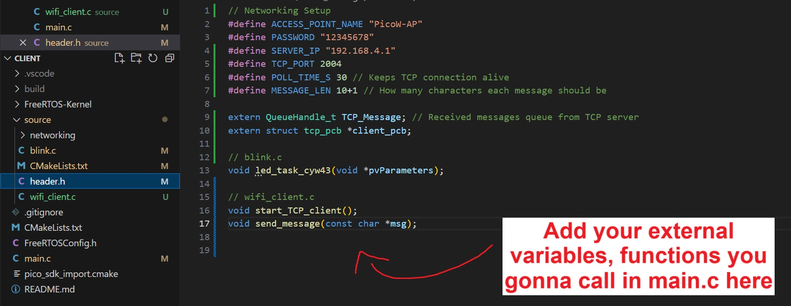
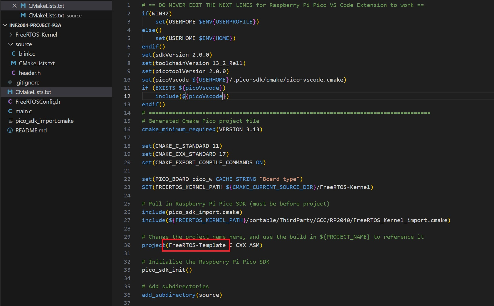
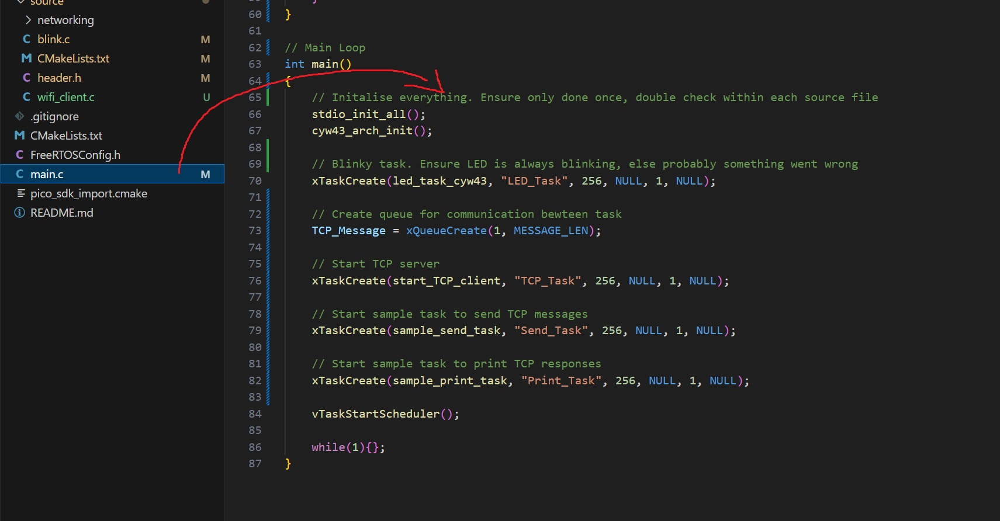

# INF2004-Project-P3A
**Robotic Car Project - Team P3A**

## Main Code
- Pico (Robotic Car) - 'Multicore' branch [here](https://github.com/ExpiredTapWater/INF2004-Project-P3A/tree/Multicore)
- ESP32/Pico (Remote) - 'Remote' branch [here](https://github.com/ExpiredTapWater/INF2004-Project-P3A/tree/Remote)

## Before Creating Your Own Branch
Clone the test branch, and try to compile and run on your pico. It is a simple Blinky program using FreeRTOS. If its working well, then you can build your code on top of it for easier merging later.

### 'Test' Branch Folder Structure
    Main Folder/
    ├── CMakeLists.txt      # Root CMakeLists.txt (No need to touch)
    ├── main.c              # Main driver code goes here (Call all your functions in here)
    ├── FreeRTOS-Kernel/    # FreeRTOS kernel directory (No need to touch)
    ├── source/             # Source folder (Put all your codes here)
        └── CMakeLists.txt  # Update this with whatever new .c file you added
        └── header.h        # Update this with your function prototypes before calling in main.c
        └── blink.c         # Simple code to test that everything is working (No need to touch)

## Help Stuff

### Where to add your functions to the header
Add them here so you can call them from main.c

### How to rename the file
Change the variable in the red box. If you somehow need to reference it, use ${PROJECT_NAME}

### Where to call your functions in main.c
Add them here so you can call them from main.c

